# Thinking
rules are useful? train for what

# workflow

generate:
generate_semgrep_rules | genertate_rule_batch -> (get_semgrep_rules_from_batch_response) -> vaildate_rules -> test_rule_positive (train dataset) -> fix_rule -> move_rules_bystatus
-> test_rule_negative (train dataset) -> move_rules_bystatus -> test_rules_batch | test_cwe_rules (test dataset) -> print_metrics_from_csv
# files
main.py: detect vulnerabilities by LLMs
generate.py: generate,test and fix rules 
train.py: slice data by CWE.

# analysis tools
joern semgrep

# dataset
1. devign: dict_keys(['project', 'commit_id', 'target', 'func'])  total(27318) vul(12460)
2. primevul_train_paired: dict_keys(['idx', 'project', 'commit_id', 'project_url', 'commit_url', 'commit_message', 'target', 'func', 'func_hash', 'file_name', 'file_hash', 'cwe', 'cve', 'cve_desc', 'nvd_url']) total(7578) vul(3789).
In primevul dataset, there are repeated samples. For example, same idx samples(two 349259 samples, two 439495 samples) in primevul_test_paired.

# run:
local_huggingface_model: .venv/bin/python main.py --dataset devign --base_model Meta-Llama-3-8B

default model: .venv/bin/python main.py --dataset devign

generate rules: python generate.py --dataset primevul_train_paired

# semgrep output 
## error types:
 {'PartialParsing', 'InvalidRuleSchemaError', 'Other syntax error', 'Rule parse error', 'SemgrepError', 'Syntax error'}
rule errors: 'InvalidRuleSchemaError', 'Rule parse error'

# test result
## primevul test paired:
### True positive rules:
semgrep test all:
Length: 870
Accuracy: 0.4989
Precision: 0.4994
Recall: 0.9310
FPR: 0.9333         
F1: 0.6501
semgrep test by cwe rules:
Length: 870
Accuracy: 0.5011
Precision: 0.5040
Recall: 0.1448
FPR: 0.1425
F1: 0.2250

### True negative rules:
True positive: 1625, -> True Negatives: 1027, Run Errors: 0

semgrep test all:
Total:870, true_positive:322,false_positive:329, Precision:0.4946236559139785
Length: 870
Accuracy: 0.4897
Precision: 0.4931
Recall: 0.7402
FPR: 0.7609
F1: 0.5919
semgrep test by cwe rules:
Total:870, true_positive:21,false_positive:18, Precision:0.5384615384615384
Length: 870
Accuracy: 0.5023
Precision: 0.5250
Recall: 0.0483
FPR: 0.0437
F1: 0.0884

### fixed rules

## primevul train paired ? !
### True Negatives: 1027
semgrep test all:
Length: 7578, positive samples num:3789, negative samples num:3789, true_positive:2092, false_positive:1438
Accuracy: 0.5863
Precision: 0.5926
Recall: 0.5521
FPR: 0.3795
F1: 0.5717
### (fixed rules:666 + positive:1625) -> negative:1411
test total:734678, rule num:1411, true_positive:2765,false_positive:2225, Precision:0.5541082164328658
Length: 7578, positive samples num:3789, negative samples num:3789, true_positive:2765, false_positive:2225
Accuracy: 0.5713
Precision: 0.5541
Recall: 0.7297
FPR: 0.5872
F1: 0.6299

## primevul test
### (fixed rules:666 + positive:1625) -> negative:1411
test total:2404436, rule num:1411, true_positive:265,false_positive:5551, Precision:0.04556396148555708
Length: 24788, positive samples num:549, negative samples num:24239, true_positive:265, false_positive:5551
Accuracy: 0.7646
Precision: 0.0456
Recall: 0.4827
FPR: 0.2290
F1: 0.0833

# test data
try 201 rules:
naive (qwen-max):       Total positive samples: 201, True Positives: 110, Run Errors: 63
fixed rules (gemma3): Total positive samples: 201, True Positives: 119, Run Errors: 50

native (qwen-plus): Total positive samples: 201, True Positives: 90, Run Errors: 44
fixed rules (gemma3): Total positive samples: 201, True Positives: 93, Run Errors: 32

# to do
1. fix rules that get false negative result in first positive test and false positive.
2. remove_fix_pattern in rule yaml file by python code.
3. when semgrep output errors unrelated to rule (errors about code), we should detect code vul by other method.  (only a few, maybe 151 functions in primevul)

uv pip install --pre torch torchvision torchaudio --index-url https://download.pytorch.org/whl/nightly/cu128